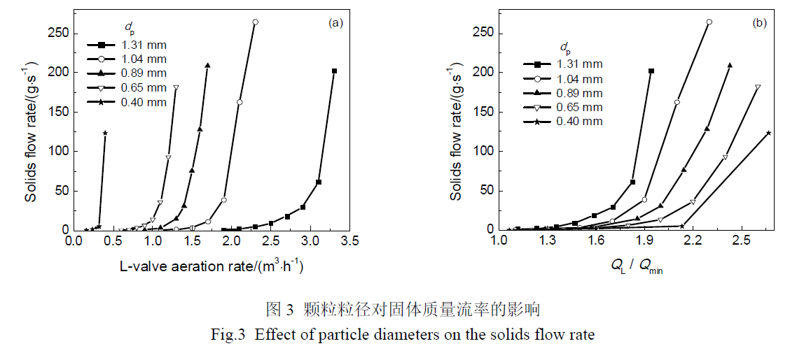

循环流化床燃烧器的返料装置由立管和阀组成，L阀是常见的一种阀。  
本试验围绕**颗粒粒径**、**L阀水平段长度**、**充气点位置**、**吹气量**和**立管高度**对L阀固体流量调节特性的影响展开研究。  
  
# L阀水平段长度对返料的影响  
1. &emsp;L阀水平段过短可能引起粉料自流，物料在阀内无法自锁，而水平段过长会增加流动阻力，造成充气点压力过高，气体可能向竖直段反窜，甚至造成流化。  
2. &emsp;相同通气量前提下，水平段短有助于增加返料量；  
3. &emsp;颗粒在L阀水平段呈沙丘状向前移动，通气量越大沙丘产生频率越高；  
4. &emsp;通气量较小时，颗粒只在水平段上部流动，中下部属于停滞状态；  
  
# 颗粒粒径对L阀返料的影响  
1. &emsp;!