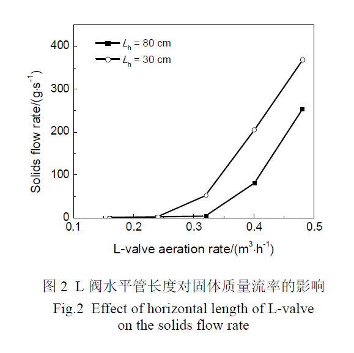

化学反应工程与工艺 第34卷第2期 [文章链接](DOI: 10.11730/j.issn.1001-7631.2018.02.0165.05 "点击跳转")
循环流化床燃烧器的返料装置由立管和阀组成，L阀是常见的一种阀。  
本试验围绕**颗粒粒径**、**L阀水平段长度**、**充气点位置**、**吹气量**和**立管高度**对L阀固体流量调节特性的影响展开研究。  
  
# L阀水平段长度对返料的影响  
1. &emsp;L阀水平段过短可能引起粉料自流，物料在阀内无法自锁，而水平段过长会增加流动阻力，造成充气点压力过高，气体可能向竖直段反窜，甚至造成流化。  
2. &emsp;相同通气量前提下，水平段短有助于增加返料量；  
3. &emsp;颗粒在L阀水平段呈沙丘状向前移动，通气量越大沙丘产生频率越高；  
4. &emsp;通气量较小时，颗粒只在水平段上部流动，中下部属于停滞状态；  

  
# 颗粒粒径对L阀返料的影响  
1. &emsp;小粒径颗粒达到返料率突变的气量区间明显小于大粒径颗粒，大粒径颗粒平稳操控区间大于小颗粒平稳操控区间；
2. &emsp;大粒径颗粒形成沙丘状的频率和尺寸明显小于小颗粒粒径，且在较大和较小充气量下沙丘移动不明显；
!  
  
## 充气点高度对L阀返料的影响  
1. 随着充气位置提高，L阀对颗粒质量流量调节更加稳定，控制精度更高，调节范围更宽，所以在立管高度允许的情况下，适当的提高充气点位置，更有助于对颗粒质量流率的精确调节；  
2. 试验发现随充气点位置提高，对l阀进行启动时，需要更高的压头，一旦颗粒开始流动，所需压头迅速降低；  
  
## 立管物料高度对L阀返料的影响  
当充气量较小时，立管高度对颗粒的质量流率并未产生明显影响，但随着充气流量的增大，立管高度越高，在相同的充气流量之下，颗粒的质量流率也就越大。对比发现，立管高度对于小粒径颗粒（Gledart&ensp;A类）的影响作用要高于对大粒径颗粒（Gledart&ensp;B类）。  
